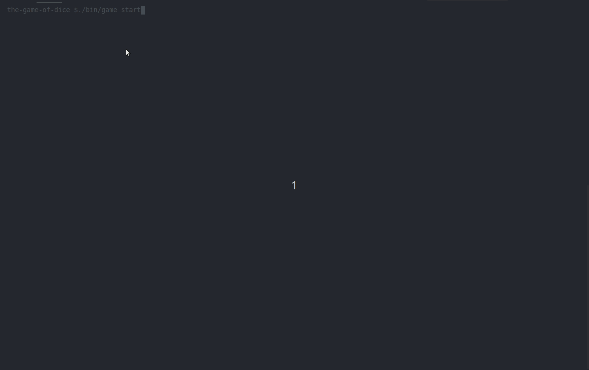

# The Game of Dice

## Introduction

The "Game of Dice" is a multiplayer game where N players roll a 6 faced dice in a round-robin fashion. 
Each time a player rolls the dice their points increase by the number (1 to 6) achieved by the roll.

As soon as a player accumulates M points they complete the game and are assigned a rank.
Remaining players continue to play the game till they accumulate at least M points. 
The game ends when all players have accumulated at least M points.

## Rules

- The order in which the users roll the dice is decided randomly at the start of the game.
- If a player rolls the value "6" then they immediately get another chance to roll again and move ahead in the game.
- If a player rolls the value "1" two consecutive times then they are forced to skip their next turn as a penalty.

## Implementation

The Game of Dice has been implemented using [Node.js](https://nodejs.org) and [TypeScript](https://www.typescriptlang.org/). The codebase has been designed and developed in such a way that it should be easy to understand and maintain. 
Further, all the important functions have been properly documented to enhance the readability.


## Prerequisites

- [Node.js](https://nodejs.org/en/) - a JavaScript runtime built on Chrome's V8 JavaScript engine.


## Setup

1. Move in `the-game-of-dice` directory

```bash
$ cd the-dice-of-game
```

2. Install required dependencies

```bash
$ npm install
```

3. Build `the-game-of-dice` project

```bash
$ npm run build
```

4. Start the game

```bash
$ ./bin/game start
```

4. Executes test cases

```bash
$ npm run test
```

## Supported CLI commands

1. **help**: CLI command to display help for any command of the executable

Example:
```bash
$ ./bin/game --help

Usage: dicegame [options] [command]

Options:
  -V, --version   output the version number
  -h, --help      display help for command

Commands:
  start           to start an new Game of Dice
  rules           the rules of the game
  help [command]  display help for command

Use "dicegame <command> --help" for more information about a given command.
```

2. **rules**: CLI command to display basic rules of the game

Example:
```bash
$ ./bin/game rules

The "Game of Dice" is a multiplayer game where N players roll a 6 faced dice in a round-robin fashion. Each time a player rolls the dice their points increase by the number (1 to 6) achieved by the roll.

As soon as a player accumulates M points they complete the game and are assigned a rank. Remaining players continue to play the game till they accumulate at least M points. The game ends when all players have accumulated at least M points.

*** Rules of the game ***
- The order in which the users roll the dice is decided randomly at the start of the game.
- If a player rolls the value "6" then they immediately get another chance to roll again and move ahead in the game.
- If a player rolls the value "1" two consecutive times then they are forced to skip their next turn as a penalty.
```

3. **start**: CLI command to start the game

Example:
```bash
$ ./bin/game start

  _____ _             ____                               __   ____  _          
 |_   _| |__   ___   / ___| __ _ _ __ ___   ___    ___  / _| |  _ \(_) ___ ___ 
   | | | '_ \ / _ \ | |  _ / _` | '_ ` _ \ / _ \  / _ \| |_  | | | | |/ __/ _ \
   | | | | | |  __/ | |_| | (_| | | | | | |  __/ | (_) |  _| | |_| | | (_|  __/
   |_| |_| |_|\___|  \____|\__,_|_| |_| |_|\___|  \___/|_|   |____/|_|\___\___|
                                                                               
? Select total number of players (minimum = 2) 
```

## Demo

